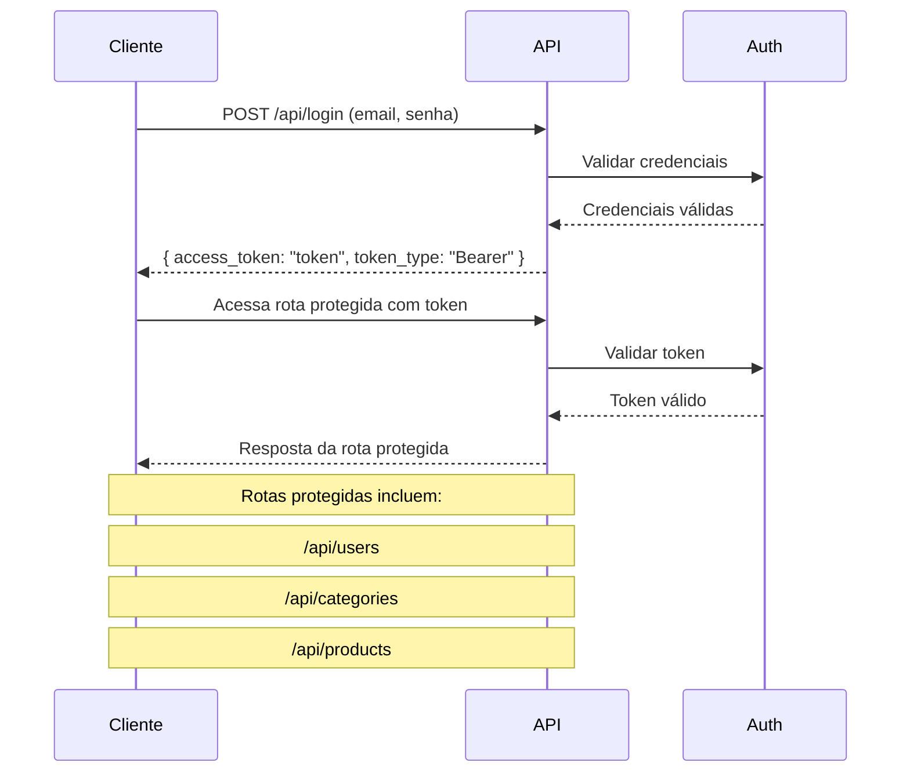

# Curso: FastAPI Avançado 2023 | 2 Projetos | TDD | PostgreSQL

## Projeto [2]

Este projeto consiste em uma API para gerenciar usuários, produtos e categorias de produtos. Desenvolvida com FastAPI, PostgreSQL, Docker e Docker Compose, a API fornece funcionalidades essenciais para criação, edição, exclusão e listagem de usuários, produtos e categorias.


## Funcionalidades

**1. Autenticação de Usuário:**

* Os usuários podem autenticar-se enviando seu email e senha para a rota /api/login.

* Se as credenciais forem válidas, a API retorna um token de acesso (access_token) e o tipo de token (token_type), que será usado para acessar as rotas protegidas.

**2. Proteção de Rotas:**

* A API inclui várias rotas protegidas que requerem um token de acesso válido para serem acessadas. Essas rotas são:
* /api/users
* /api/categories
* /api/products**
* Apenas usuários autenticados com um token válido podem acessar essas rotas.

**3. Gerenciamento:**

* Usuários: Criação, edição, exclusão e listagem de usuários.
* Categorias: Criação, edição, exclusão e listagem de categorias de produtos.
* Produtos: Criação, edição, exclusão e listagem de produtos.

### Fluxo de Autenticação



### Dependências e Configuração

Este projeto utiliza várias bibliotecas e ferramentas para facilitar o desenvolvimento e a execução da aplicação. A seguir estão listadas as principais dependências e suas funções:

1. FastAPI: Framework web utilizado para construir a API.
2. SQLAlchemy: ORM (Object-Relational Mapper) usado para interagir com o banco de dados PostgreSQL.
3. Alembic: Ferramenta de migração de banco de dados para SQLAlchemy.
4. python-decouple: Biblioteca para gerenciar variáveis de ambiente.
5. psycopg2-binary: Driver para PostgreSQL.
6. passlib: Biblioteca para hashing de senhas.
7. python-jose: Biblioteca para gerar e verificar tokens JWT.
8. uvicorn: Servidor ASGI para rodar a aplicação FastAPI.
9. fastapi-pagination: Biblioteca para adicionar paginação aos endpoints da API.
10. pytz: Biblioteca para manipulação de fusos horários.
11. pytest: Framework de testes utilizado para desenvolvimento orientado a testes (TDD).

### Execução

Para executar a aplicação, siga os passos abaixo:

* Clone o repositório:

```bash
git clone https://github.com/mr-reinaldo/Curso-FastAPI-Avancado-Projeto02.git
```

* Acesse o diretório do projeto:

```bash
cd Curso-FastAPI-Avancado-Projeto02
```

* Renomeie o arquivo .env.example para .env e configure as variáveis de ambiente:

```bash
cp .env.example .env
```

* Execute o comando docker-compose up para iniciar os serviços:

```bash
docker compose up -d
```

* Acesse a documentação Swagger da API em <http://localhost:8000/docs>.
* Acesse a documentação ReDoc da API em <http://localhost:8000/redoc>.
* Para parar os serviços, execute o comando docker-compose down:

```bash
docker compose down
```
